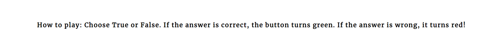

# Animal Quiz

Animal quiz is a website dedicated to provide it’s users with tons of animal trivia, presented in a fun, challenging way! Here, our users can learn about animals by testing their wits in a fun quiz. We’ve scoured the globe for fun and interesting tidbits about all the animals we share this earth with, and we can guarantee, you will find some interesting tidbit you’ll want to share with your friends! 

<!-- placeholder: screenshots for website on different devices  -->

## Features

### Heading
A simple welcoming heading for all to see. It serves the purpose to welcome the user, clearly state the intention of the website, aswell as intice the user to take the quiz by posing a challange.

### Start game button
For maximum simplicity, the questions are hidden behind a simple CTA (call to action) in the form of a button, the button changes colors when hovered over.  

### Footer
Clear instructions are written in the footer to help new players, aswell as describe a key feature of the site; the changing of the colors of the buttons. 

### The Quiz area
The quiz contains 3 important components: 

First: the statement about an animal. 

Second: a picture of the animal in question to help with visual clarity aswell as making the quiz more visual appealing. 

Third: the buttons. The buttons are simplly true/false. When clicked, the button will turn green if the answer was correct, and it will turn red if the answer was incorrect. It will stay it’s new color for a while in order for the person to notice, after that a new question will appear. This way the user will get feedback throughout the quiz. 

### The score area
After all the questions has been answered, the user will recieve feedback in the manner of a score. Along with the score a message will be displayed, either congratulating the user for it’s achievements or spurring the user to try again.  It does so by placing a new button, with a new question that resets the quiz, making it very easy for the user to go again.  

## Features left to implement
Some features left to implement for future projects: 

* More animal facts. 

* A leaderboard to pit users against each other. 

## Testing

### User experience
the site was deployed and tested for Chrome, Firefox and Edge. The quiz was taken multiple times for each browser with the following results:
* The score updated as expected for all browser, and the correct message was displayed after the quiz for every score.
* The images were displayed correctly, although, at times, the text loaded prior to the associated picture. This isn't a bug per se, but can negative impact the user experience somewhat.
* When the user retook the quiz, the score reset as expected.
* The webpage was created with responsive design and displayed correctly for different screensizes, with some media queries to increase the user experience for smaller screens.

### Validation testing

* No erros were found when cheching the HTML with the official [W3C HTML Validator](https://validator.w3.org/)
* No errors were found when checking the CSS with the official [Jigsaw CSS Validator](https://jigsaw.w3.org/css-validator/)
* No errors were found when checking the JS with the offical [Jshint validator](https://jshint.com/). However, this code did recieve 13 unclear warnigs for variabels being used. 
* jShint Metrics: There are 13 functions in this file. Function with the largest signature take 1 arguments, while the median is 0. Largest function has 9 statements in it, while the median is 2. The most complex function has a cyclomatic complexity value of 6 while the median is 1.

* Accessibility
This site was tested with the Chrome extension Lighthouse with the following score:

### Fixed bugs
Bug encountered: When a user first took the quiz, the first option true/false would change color when hovered over. This was not the case for subsequent true/false buttons. This bug would also go away if the user retook the quiz, making it initially hard to spot.

* Cause: The cause of this bug was a hover pseudo-class that would appear on all buttons, and was most likely overwritten when Javascript applied direct styles to the true/false buttons. This would explain why retaking the test did not have this bug.

* Fix: The hover pseudo-class was changed to only be applied to specific buttons.

* Outcome: The bug was fixed and the implementation is working as expected, although initially another bug appeared when the fix was implemented, which led to the start game button not changing color. This was due to a spelling error and later fixed. 

### Unfinnished bugs
Bug encountered: Sometimes when a new image loads, it pushes all the other content down on the screen. This is not a major bug, but it leads to a worse user experience.

* Cause: The cause of this bug may be due to how the css-selectors load the image and text in relation to the other elements on the screen.

* Fix (fail): Different css-selectors were tested in dev-tools, such as setting fixed hights for container divs.

* Outcome: This led to a significant worse user experience, especially for different screen-sizes.

## Deployment
This webpage was deployed to Github pages. The steps to deploy are:
* Go to the Github repository.
* Navigate to the settings tab.
* Select pages in the menu.
* From the source section drop-down menu, select the Main branch.
* Once the main branch has been selected, the page prrovides the link to the completed website.

The live link can be found here: https://hampusmatt.github.io/AnimalQuizProject/

## Credits

### Content
* The Code institute full Gitpod template was used.
* The font used was taken and implementet from [Google Fonts](https://fonts.google.com/)
* Information for animal facts was sourced from [Wikipedia](https://www.wikipedia.org/)

### Media
* The pictures were sourced from the free img database [Pexels](https://www.pexels.com/).

### READ ME
Mockup was taken from [Techsini](http://techsini.com/multi-mockup/index.php)